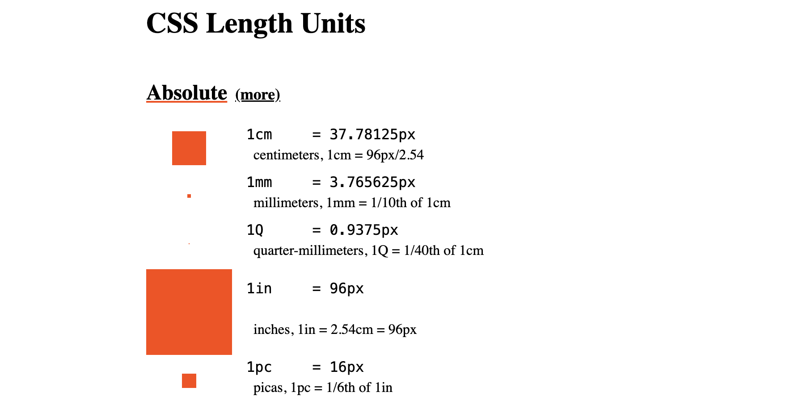

# Multiple personal projects

## CSS length units

This page lists all possible available length units in CSS (see [spec here](https://www.w3.org/TR/css-values-4/#lengths)).

It also groups & displays them in a readable manner. Visit https://ayc0.github.io/projects/length-units/ to view it.

## React timings

Experimental lab to try how & when React life cycles happen.

## Hexagons

Experiment to play with React & Canvas to place hexagons in a compact way

## Color Visualizer

Live playground to convert colors from different color spaces
